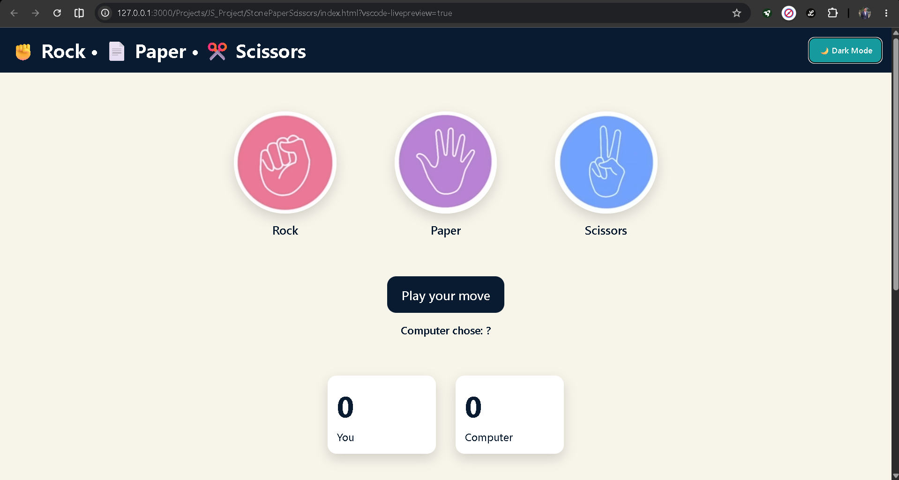

# ✊ Rock Paper Scissors Game

A modern and interactive Rock Paper Scissors game built using **HTML**, **CSS**, and **JavaScript**. The game includes score tracking, game statistics, dark/light mode, local storage support, and an intuitive user interface.

---

## 🌐 Live Demo

[Play the game](https://shashwatss10.github.io/Rock-Paper-Scissors/)

---

## 📸 Screenshot



```text
Stone-Paper-Scissors/
│
├── Screenshot/
│   └── rock-paper-scissors.png
```

---

## 🚀 Features

### 🎮 Gameplay

* Rock vs Paper vs Scissors game logic
* Random computer choice generation
* Instant result display
* Computer choice display
* Last round summary

### 📊 Statistics

* Total Wins
* Total Losses
* Total Draws
* Live scoreboard

### 💾 Local Storage

* Scores persist after page refresh
* Statistics persist after page refresh
* Theme preference is remembered

### 🎨 User Interface

* Modern card-based design
* Smooth hover animations
* Responsive layout
* Dark Mode / Light Mode toggle

### 🔄 Game Controls

* Reset Game button
* Reset statistics and scores
* Restart gameplay instantly

---

## 🛠️ Technologies Used

* HTML5
* CSS3
* JavaScript (ES6)
* Local Storage API

---

## 📂 Project Structure

```text
Rock-Paper-Scissors/
│
├── index.html
├── .gitignore
├── app.js
├── README.md
├── style.css
├── Screenshot
│   └──rock-paper-scissors.png
└── Assets/
    ├── Rock.png
    ├── Paper.png
    └── Scissors.png
```

---

## ▶️ How to Run

1. Clone the repository: 
   
    https://github.com/Shashwatss10/Rock-Paper-Scissors.git

2. Open the project folder

3. Open `index.html` in your browser
  
No additional setup is required.

---

## 🎯 Learning Outcomes

This project demonstrates:

* DOM Manipulation
* Event Handling
* JavaScript Game Logic
* CSS Animations
* Local Storage
* Theme Switching
* State Management

---

## 👨‍💻 Author

**Shashwat Sharma**

4th Year B.Tech Computer Science & Engineering Student
